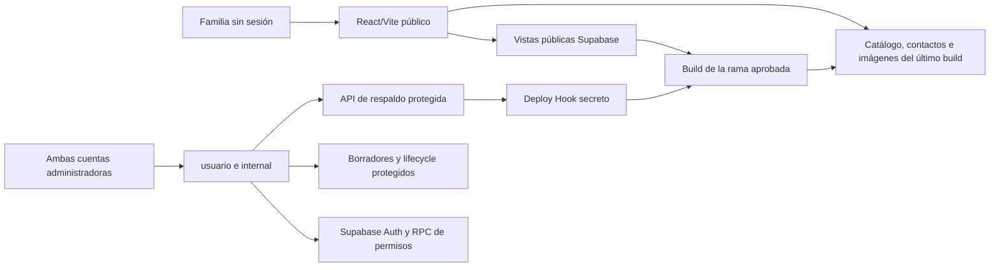
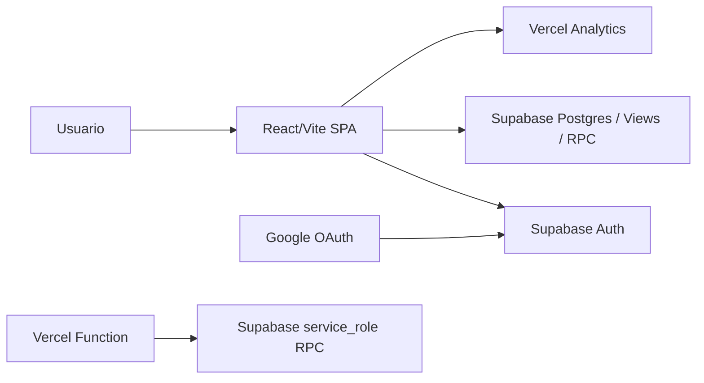

# Architecture

## Arquitectura vigente: mantenimiento gratuito

Estado: **Partial**. `main` está publicado en `nensgo.com`; SQL, permisos,
Deploy Hook y planes Hobby/Free están configurados y comprobados. Quedan el
cierre de altas por el usuario y la validación interactiva de ambas sesiones
y del botón administrativo.

```mermaid
flowchart LR
  Family[Familia sin sesión] --> Public[React/Vite público]
  Public --> Views[Vistas públicas Supabase]
  Public --> Snapshot[Catálogo, contactos e imágenes del último build]
  Admin[Ambas cuentas administradoras] --> Private[usuario e internal]
  Private --> Auth[Supabase Auth y RPC de permisos]
  Private --> Drafts[Borradores y lifecycle protegidos]
  Private --> API[API de respaldo protegida]
  API --> Hook[Deploy Hook secreto]
  Hook --> Build[Build de la rama aprobada]
  Views --> Build
  Build --> Snapshot
```

El cliente público es anónimo y sin persistencia de sesión. El proveedor de Auth
se monta únicamente en `/usuario` y `/internal/*`; `is_maintenance_operator`
comprueba pertenencia a la allowlist y permiso previo `draft_inbox`. Los campos
públicos se declaran en `src/shared/publicCatalogBackupContract.mjs`.

`npm.cmd run build` exporta una copia pública e imágenes locales después de
compilar. Las lecturas de catálogo/contactos usan esa copia validada cuando
falla Supabase. La API solicita el deploy y el panel sólo confirma un nuevo
manifiesto publicado. No hay analítica, reporting PVI activo ni cron; no se
necesita una clave `service_role` para este mecanismo.

Supabase utiliza su URL estándar `https://xgvsinjbvsohnreifxcj.supabase.co`;
el complemento de pago `auth.nensgo.com` se retiró sin cambiar el dominio público.
Las imágenes conservan rutas relativas en Storage. El hook de `main` y su secreto
se limitan a Production; se comprobó una nueva generación realmente publicada.

Los contratos anteriores que siguen son **históricos**, incluidos Auth global,
onboarding, favoritos, eventos y Analytics. No forman parte de la app activa.
Detalle operativo: [runbook](../03_OPERATIONS/MAINTENANCE_RUNBOOK.md).

## Referencia anterior (histórica)

## Modelo general

NensGo es una SPA React/Vite. La app corre en navegador y usa Supabase para identidad, datos de producto y RPCs. Vercel sirve la app y expone una función interna server-side.

```mermaid
flowchart LR
  User[Usuario] --> Web[React/Vite SPA]
  Web --> Auth[Supabase Auth]
  Web --> DB[Supabase Postgres / Views / RPC]
  Web --> Analytics[Vercel Analytics]
  Google[Google OAuth] --> Auth
  Vercel[Vercel Function] --> AdminRPC[Supabase service_role RPC]
```

## SPA structure

- `src/main.jsx` monta React.
- `src/App.jsx` define routing y providers.
- `I18nProvider` envuelve la app.
- `AuthProvider` envuelve las rutas y monta `ProtectedAccessGate`.
- `Analytics` se monta una vez después de las rutas.

## Routing model

La app usa React Router con tres tipos de superficie:

- Pública: accesible sin sesión.
- Protegida: requiere sesión, email verificado y perfil app mínimo.
- Interna: requiere usuario ready y autorización en `internal_tool_access`.
- El alta manual interna de actividad vive en Draft Inbox y crea `activity_drafts`; no publica directo en `activities`.

## Supabase data access pattern

- `src/services/supabaseClient.js` crea el cliente browser con anon key.
- Servicios en `src/services` encapsulan lecturas/escrituras por dominio.
- Hooks de React exponen estado de UI.
- Las vistas Supabase actúan como read models públicos.
- Las RPCs gestionan operaciones que no deben resolverse con inserts directos desde frontend.

## Read models / views

- `catalog_activities_read`: catálogo público.
- `activity_contact_options_read`: contactos activos y seguros para actividades visibles.
- `municipality_choices_read`: búsqueda de municipios ES DIR3.

## Activity descriptions

- `description` es la fuente editorial canónica.
- `description_format` define renderizado `plain` o `markdown`.
- `short_description` queda como salida deprecated de compatibilidad del read model, no como campo gestionado por editores.
- Los resúmenes plain-text para búsqueda, detección o previews se derivan de `description`.
- El detalle público puede renderizar Markdown seguro; las cards compactas siguen controladas/plain.

## Auth/profile flow

1. Supabase Auth entrega sesión.
2. `AuthContext` resuelve usuario y email verification.
3. La app lee `user_profiles`.
4. Si falta perfil mínimo, abre onboarding.
5. Onboarding llama `ensure_my_profile`.
6. Estado final esperado: `ready`.

## Contact flow

1. El usuario abre detalle.
2. Se leen contact options por actividad desde `activity_contact_options_read`.
3. La UI decide entre directo, selector o sin CTA.
4. Se registra evento en `activity_contact_events` cuando aplica.

## Favorites flow

1. La acción protegida puede guardarse en `sessionStorage`.
2. Cuando el usuario está `ready`, se ejecuta.
3. `useFavorites` lee/escribe `user_favorite_activities`.
4. La UI actualiza estado optimista y revierte si Supabase falla.

## I18n provider

- `src/i18n/I18nProvider.jsx`.
- Diccionarios: `src/i18n/locales/es.js`, `ca.js`, `en.js`.
- Idioma por defecto: `es`.
- Persistencia: `nensgo.language`.
- Actualiza `<html lang>`.

## SEO/head management

- `SeoHead` actualiza `document.title`, meta description, robots y canonical.
- Canonical actual: `https://nensgo.com`.
- Sitemap y robots viven en `public/`.
- No hay `hreflang` porque el idioma no se refleja en la URL.

## Deployment assumptions

- Vercel sirve el frontend y la API interna.
- Supabase contiene datos y auth.
- Secrets server-only viven fuera del bundle frontend.
- SQL debe aplicarse antes de tratar el entorno como operativo.
